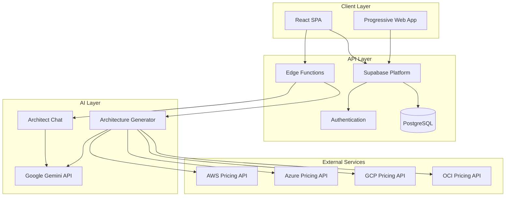

# SolsArch - AI Solutions Architect Platform

## Executive Summary

**SolsArch** is an enterprise-grade, AI-powered cloud architecture design platform that revolutionizes how organizations plan, design, and optimize their cloud infrastructure. By leveraging advanced artificial intelligence and comprehensive multi-cloud cost intelligence, SolsArch empowers architects, developers, and technical teams to make data-driven infrastructure decisions across AWS, Azure, Google Cloud Platform (GCP), and Oracle Cloud Infrastructure (OCI).

### Key Value Proposition

- **Reduce Architecture Design Time by 90%**: What traditionally takes days or weeks can be accomplished in minutes
- **Optimize Cloud Costs by 20-60%**: AI-driven recommendations identify cost-saving opportunities across providers
- **Eliminate Vendor Lock-in**: Design hybrid multi-cloud architectures that leverage the best services from each provider
- **Accelerate Time-to-Market**: Generate production-ready infrastructure-as-code templates instantly

---

## 🎯 Core Features

### 1. AI-Powered Architecture Design

**Conversational AI Architect**
- Natural language interface for describing application requirements
- Context-aware recommendations based on industry best practices
- Comprehensive understanding of all application types (web, mobile, desktop, API, AI/ML, IoT)
- Real-time architecture refinement through interactive chat

**Multi-Variant Generation**
- **Cost-Optimized**: Minimize expenses while meeting requirements
- **Balanced**: Optimal trade-off between cost and performance
- **Performance-Optimized**: Maximum speed, reliability, and scalability
- **Hybrid Multi-Cloud**: Best-of-breed services across providers

### 2. Intelligent Cost Analysis

**Real-Time Multi-Cloud Cost Comparison**
- Side-by-side pricing for AWS, Azure, GCP, and OCI
- Component-level cost breakdown with SKU details
- Monthly and annual cost projections
- TCO (Total Cost of Ownership) analysis

**Cost Optimization Engine**
- AI-driven recommendations with impact percentages
- Reserved instance and savings plan suggestions
- Spot instance opportunities for fault-tolerant workloads
- Right-sizing recommendations based on actual usage patterns

**Hybrid Cloud Cost Intelligence**
- Calculate costs when mixing services across providers
- Provider-specific cost breakdowns
- Identify the most cost-effective provider per service type
- Network egress cost analysis for multi-cloud architectures

### 3. Visual Architecture Tools

**Interactive Architecture Diagrams**
- Auto-generated Mermaid diagrams from AI recommendations
- Customizable component relationships and data flows
- Support for complex multi-tier architectures
- Real-time diagram updates as architecture evolves

**Component Browser**
- Detailed specifications for every cloud service
- SKU comparison across providers
- Performance characteristics and limitations
- Compliance and security certifications

**Export Capabilities**
- **Documentation**: PDF and PNG exports with full architecture details
- **Infrastructure-as-Code**: Terraform, Pulumi, CloudFormation, Azure ARM templates
- **Diagrams**: High-resolution architecture diagrams
- **Cost Reports**: Detailed cost analysis spreadsheets

### 4. Enterprise-Grade Features

**GPU Workload Optimization**
- Specialized recommendations for AI/ML workloads
- GPU instance comparison (NVIDIA A100, H100, V100, etc.)
- Cost optimization for training vs. inference workloads
- Multi-GPU and distributed training architectures

**Compliance & Security**
- Pre-configured templates for SOC2, HIPAA, PCI-DSS, GDPR
- Security best practices built into every architecture
- Encryption at rest and in transit
- Identity and access management patterns

**Multi-Region Architecture**
- Global deployment strategies
- Latency optimization across regions
- Disaster recovery and business continuity patterns
- Active-active and active-passive configurations

**Version History & Collaboration**
- Track architecture iterations over time
- Compare different versions side-by-side
- Team collaboration features (roadmap)
- Architecture approval workflows (roadmap)

---

## 🏗️ Technical Architecture

### Frontend Stack

```
React 18.3 + TypeScript 5.8
├── UI Framework: shadcn/ui + Radix UI
├── Styling: Tailwind CSS 3.4
├── State Management: TanStack Query (React Query)
├── Routing: React Router DOM 6.30
├── Charts: Recharts 2.15
├── Diagrams: Mermaid.js 11.12
└── Build Tool: Vite 5.4
```

### Backend Infrastructure

```
Supabase Platform
├── Database: PostgreSQL (managed)
├── Authentication: Supabase Auth (OAuth, Email/Password)
├── Edge Functions: Deno runtime
│   ├── architect-chat: AI chat interface
│   └── generate-architecture: Architecture generation
├── Real-time: WebSocket subscriptions
└── Storage: Object storage for exports
```

### AI & Machine Learning

```
Google Gemini 2.0 Flash Exp
├── Model: gemini-2.0-flash-exp
├── Context: 1M+ token context window
├── Capabilities:
│   ├── Architecture design
│   ├── Cost optimization
│   ├── Code generation (IaC)
│   └── Natural language understanding
└── API: Google AI API (direct integration)
```

### Architecture Diagram



---

## 💼 Use Cases & Benefits

### For Enterprise Architects

**Challenge**: Designing cloud architectures requires deep knowledge of multiple cloud providers, constant price monitoring, and balancing competing requirements.

**Solution**: SolsArch provides instant access to AI-powered architecture recommendations with real-time cost comparisons across all major cloud providers.

**Benefits**:
- Reduce architecture design time from weeks to hours
- Make data-driven decisions with comprehensive cost analysis
- Ensure compliance and security best practices
- Generate documentation and IaC templates automatically

### For Startups & SMBs

**Challenge**: Limited resources and expertise to design optimal cloud infrastructure, leading to over-provisioning or poor architecture choices.

**Solution**: SolsArch democratizes enterprise-grade architecture expertise through AI, making it accessible to teams of any size.

**Benefits**:
- Avoid costly architecture mistakes from day one
- Scale efficiently without over-spending
- Access enterprise-level best practices
- Reduce dependency on expensive consultants

### For Cloud Consultants

**Challenge**: Clients expect rapid turnaround on architecture proposals with detailed cost analysis and multiple options.

**Solution**: SolsArch accelerates the proposal process while maintaining high quality and professionalism.

**Benefits**:
- Generate multiple architecture variants in minutes
- Provide clients with detailed cost comparisons
- Export professional documentation and diagrams
- Focus on strategic advice rather than manual calculations

### For DevOps Teams

**Challenge**: Translating architecture designs into infrastructure-as-code while ensuring cost efficiency and best practices.

**Solution**: SolsArch generates production-ready IaC templates from architecture designs.

**Benefits**:
- Eliminate manual IaC creation
- Ensure consistency across environments
- Implement cost optimization from the start
- Accelerate infrastructure deployment

---

## 🚀 Getting Started

### Prerequisites

1. **Node.js 18+** - [Install via nvm](https://github.com/nvm-sh/nvm)
2. **Supabase Account** - [Sign up at supabase.com](https://supabase.com)
3. **Google AI API Key** - [Get from Google AI Studio](https://makersuite.google.com/app/apikey)

### Quick Start

```bash
# Clone the repository
git clone <your-repo-url>
cd solsarch1

# Install dependencies
npm install

# Configure environment variables
cp .env.example .env
# Edit .env with your Supabase credentials

# Start development server
npm run dev
```

### Supabase Configuration

```bash
# Install Supabase CLI
npm install -g supabase

# Login and link project
supabase login
supabase link --project-ref your-project-ref

# Set Google AI API key
supabase secrets set GOOGLE_AI_API_KEY=your_api_key

# Deploy edge functions
supabase functions deploy architect-chat
supabase functions deploy generate-architecture
```

### Production Deployment

```bash
# Build for production
npm run build

# Deploy to Vercel (recommended)
vercel deploy --prod

# Or deploy to Netlify
netlify deploy --prod

# Or deploy to Cloudflare Pages
# Upload dist/ folder via dashboard
```

---

## 📊 Pricing Intelligence

### Multi-Cloud Cost Database

SolsArch maintains an up-to-date database of pricing information across:

- **AWS**: 200+ services, 1000+ instance types
- **Azure**: 150+ services, 800+ VM sizes
- **GCP**: 100+ services, 500+ machine types
- **OCI**: 80+ services, 300+ instance types

### Cost Optimization Strategies

1. **Right-Sizing**: Match instance types to actual workload requirements
2. **Reserved Capacity**: Identify opportunities for 1-year or 3-year commitments
3. **Spot Instances**: Recommend spot/preemptible instances for fault-tolerant workloads
4. **Auto-Scaling**: Design architectures that scale based on demand
5. **Multi-Cloud Arbitrage**: Leverage price differences across providers

---

## 🔒 Security & Compliance

### Security Features

- **Authentication**: Supabase Auth with OAuth providers (Google, GitHub, etc.)
- **Authorization**: Row-level security (RLS) in PostgreSQL
- **Data Encryption**: TLS 1.3 in transit, AES-256 at rest
- **API Security**: Rate limiting and API key management
- **Audit Logging**: Comprehensive activity logs

### Compliance Support

- **SOC 2 Type II**: Architecture templates for SOC 2 compliance
- **HIPAA**: Healthcare-specific security patterns
- **PCI-DSS**: Payment card industry compliance
- **GDPR**: Data privacy and protection patterns
- **ISO 27001**: Information security management

---

## 🛣️ Roadmap

### Q1 2025
- [ ] Team collaboration features
- [ ] Architecture approval workflows
- [ ] Custom architecture templates
- [ ] Advanced cost forecasting

### Q2 2025
- [ ] Integration with cloud provider APIs for real-time data
- [ ] Automated cost anomaly detection
- [ ] Multi-tenancy for enterprises
- [ ] Advanced security scanning

### Q3 2025
- [ ] Mobile applications (iOS/Android)
- [ ] AI-powered architecture reviews
- [ ] Integration with JIRA, Confluence, Slack
- [ ] Custom AI model fine-tuning

---

## 📞 Support & Resources

### Documentation
- **User Guide**: Comprehensive guide for all features
- **API Documentation**: REST API and SDK documentation
- **Video Tutorials**: Step-by-step video guides
- **Best Practices**: Architecture design patterns and guidelines

### Community
- **GitHub Discussions**: Community Q&A and feature requests
- **Discord Server**: Real-time chat with the community
- **Blog**: Architecture insights and case studies
- **Newsletter**: Monthly updates and tips

### Enterprise Support
- **Dedicated Support**: Priority email and chat support
- **Custom Training**: On-site or virtual training sessions
- **Architecture Reviews**: Expert review of your designs
- **Custom Development**: Feature development for enterprise needs

---

## 📄 License

This project is proprietary software. All rights reserved.

For licensing inquiries, please contact: [your-email@example.com]

---

## 🙏 Acknowledgments

Built with cutting-edge technologies:
- React Team for React 18
- Vercel for Next.js and deployment platform
- Supabase for backend infrastructure
- Google for Gemini AI
- shadcn for the beautiful UI components
- The open-source community

---

**SolsArch** - Empowering architects to build better cloud infrastructure, faster.

*Last Updated: December 2025*
